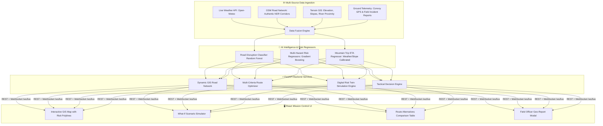
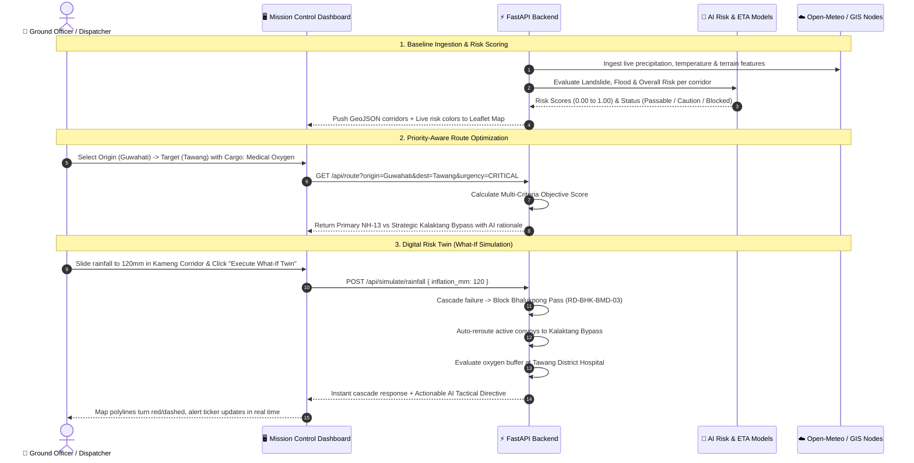

# 🏔️ NE-RAKSHAK AI
### AI-Based Smart Logistics & Accessibility Intelligence Platform for the North Eastern Region (NER)

[](https://sih.gov.in)
[](https://mdoner.gov.in)
[](https://fastapi.tiangolo.com)
[](https://react.dev)
[](https://leafletjs.com)
[](https://scikit-learn.org)

---

## 📌 1. Problem Statement & Mission Context

In the **North Eastern Region (NER) of India**, extreme monsoons, complex Himalayan terrain, high-altitude alpine passes (e.g., Sela Pass, Bhalukpong Gorge), and frequent landslides sever critical supply lifelines for days. Conventional navigation and logistics software (e.g., Google Maps) optimize purely for **distance** or **historical traffic**, directing emergency supply convoys into active landslide hazard zones or impassable river inundations.

**NE-RAKSHAK AI** solves this for the **Ministry of Development of North Eastern Region (MDoNER)** by creating an **Accessibility Intelligence & Digital Risk Twin Platform** where:
$$\text{Safety} + \text{Mission Reliability} > \text{Minimum Distance}$$

---

## 🏗️ 2. High-Level System Architecture



---

## 🔄 3. Complete End-to-End Workflow Flowchart



---

## 📐 4. Mathematical Formulations & ML Logic

### 4.1 Multi-Hazard Risk Scoring
For each road segment $i$, the overall risk probability $R_i$ is computed using Gradient Boosting regressors taking features:

$$\mathbf{x}_i = [\text{Slope}^\circ, \text{Elevation}_m, \text{Rainfall}_{24h}, \text{Rainfall}_{7d}, \text{SoilSat}, \text{RiverDist}_{km}, \text{HistDisruptions}, \text{SatWaterProxy}]$$

- **Landslide Risk ($R_{\text{landslide}}$):** High slope gradients ($\ge 20^\circ$) + high cumulative precipitation + high soil saturation.
- **Flash Flood Risk ($R_{\text{flood}}$):** Low elevation river basins + river proximity ($\le 0.5\text{ km}$) + torrential rainfall bursts.
- **Composite Risk:**
$$R_{\text{composite}} = \max(R_{\text{landslide}}, R_{\text{flood}}) \cdot 0.85 + (R_{\text{landslide}} \cdot R_{\text{flood}}) \cdot 0.15 + R_{\text{base}} \cdot 0.10$$

### 4.2 Route Optimization Objective Function
For candidate route $k$ comprising road segments $\{e_1, e_2, \dots, e_n\}$, the objective cost $J(k)$ is minimized:

$$J(k) = w_{\text{time}} \cdot \left(\frac{T_{\text{AI}}(k)}{60}\right) + w_{\text{risk}} \cdot \left(\bar{R}(k) \times 100\right) + w_{\text{cost}} \cdot \left(\frac{C_{\text{fuel}}(k)}{1000}\right) + w_{\text{dist}} \cdot \left(\frac{D(k)}{100}\right)$$

Where dynamic weight allocation shifts based on cargo priority:
- **Critical Life-Saving Cargo (Medical Oxygen / Blood Plasma):**  
  $w_{\text{risk}} = 0.55, \quad w_{\text{time}} = 0.25, \quad w_{\text{cost}} = 0.10, \quad w_{\text{dist}} = 0.10$  
  *(Heavily penalizes hazard exposure to guarantee arrival).*
- **General Freight:**  
  $w_{\text{risk}} = 0.25, \quad w_{\text{time}} = 0.40, \quad w_{\text{cost}} = 0.20, \quad w_{\text{dist}} = 0.15$

---

## 🛠️ 5. Tech Stack

| Layer | Technology | Key Role |
|---|---|---|
| **Frontend** | React 18 + Vite + TypeScript | Mission Control UI, Tactical Tabs, KPI Banners |
| **GIS Map** | Leaflet | Real-time vector polylines, animated convoy markers, custom popups |
| **Styling** | Tailwind CSS v4 | High-contrast National Logistics / NDMA Mission Control theme |
| **Backend** | FastAPI (Python 3.11+) | Async REST endpoints, Pydantic schemas, WebSocket broadcaster |
| **Machine Learning** | Scikit-Learn (Gradient Boosting & Random Forest) | High-accuracy risk and mountain travel time regressors |
| **Weather Feed** | Open-Meteo API | Free live meteorological data across 10 NER districts |
| **Realtime** | WebSockets (`/ws/live`) | Push 3-second live telemetry pulses to all connected dashboards |

---

## 🚀 6. Installation & Running Locally

### Prerequisites
- **Python 3.10+** (Tested on Python 3.11, 3.12, 3.14)
- **Node.js 18+** & **npm**

### Step 1: Clone Repository
```bash
git clone https://github.com/aryansoni70/NE--rakshak-ai-.git
cd NE--rakshak-ai-
```

### Step 2: Install Python Backend Dependencies & Train Models
```bash
# Install backend ML dependencies
python -m pip install fastapi uvicorn scikit-learn pandas numpy requests joblib httpx websockets

# Generate synthetic dataset and train ML models
python data-pipeline/generate_synthetic_data.py
python ml/train_road_risk.py
python ml/train_eta.py
```

### Step 3: Install Frontend Dependencies
```bash
npm install
```

### Step 4: Run Application
#### Option A: One-Click Windows Launcher
Double-click `start_all.bat` or run:
```cmd
.\start_all.bat
```

#### Option B: Terminal Commands
In Terminal 1 (Backend):
```bash
python -m uvicorn backend.app.main:app --host 0.0.0.0 --port 8000 --reload
```
In Terminal 2 (Frontend):
```bash
npm run dev
```

- **Mission Control UI:** [http://localhost:3000](http://localhost:3000)
- **Interactive OpenAPI Docs:** [http://localhost:8000/docs](http://localhost:8000/docs)

---

## 📡 7. API Reference

| Method | Endpoint | Description |
|---|---|---|
| `GET` | `/api/roads` | GeoJSON FeatureCollection of all 13 NER highway corridors |
| `GET` | `/api/roads/risk` | Live multi-hazard risk scores and meteorological context |
| `POST` | `/api/roads/risk/refresh` | Sync latest live weather from Open-Meteo |
| `GET` | `/api/route` | Multi-criteria corridor routing (Candidate comparison) |
| `GET` | `/api/route/best` | Top recommended route with tactical dispatch reasoning |
| `POST` | `/api/shipments` | Create shipment, compute priority score and optimal routes |
| `GET` | `/api/eta` | Nominal vs AI-predicted travel time and delay causes |
| `POST` | `/api/simulate/rainfall` | **What-If Engine:** Inflate rainfall, close passes, reroute fleet |
| `POST` | `/api/simulate/road-block` | **What-If Engine:** Block specific corridor with obstacle reason |
| `POST` | `/api/simulate/reset` | Reset simulation state back to live telemetry |
| `POST` | `/api/incidents` | Submit geo-tagged field officer ground incident |
| `GET` | `/api/vehicles` | Active convoy telemetry feed |
| `GET` | `/api/facilities` | Critical trauma hospitals & supply depots with oxygen buffer |
| `GET` | `/api/alerts` | Active live disaster warnings stream |
| `WS` | `/ws/live` | WebSocket real-time telemetry broadcaster |

---

## 🏆 8. SIH Demonstration Walkthrough (5-Minute Pitch Story)

1. **Mission Control Baseline:** Open `http://localhost:3000`. Point out the live GIS corridor network across Assam, Arunachal Pradesh, Meghalaya, and Nagaland.
2. **Convoy & Healthcare Tracking:** Show *Convoy Alpha-1* carrying critical oxygen to *Tawang District Hospital* (which has a 36-hour reserve buffer).
3. **AI Route Selection:** Switch to the **Routing** tab. Show how the AI deliberately selects the *Orang - Kalaktang Strategic Bypass* for medical cargo over the shorter NH-13 route because terrain stability prevents catastrophic entrapment.
4. **Digital Risk Twin Trigger:** Switch to the **Digital Twin** tab. Simulate a **120mm Monsoon Cloudburst**. Show how the map instantly updates: Bhalukpong Gorge turns red/black-dashed, the convoy is automatically rerouted, and an explainable AI Tactical Directive is synthesized.
5. **Ground Incident Reporting:** Click **Report Incident**, submit a real-time rockfall report from the field, and watch the entire platform update in sub-second latency.

---

## 📜 9. Data Provenance & Ethics Statement
- **Real Data:** Road network coordinates and geometry extracted from OpenStreetMap; live district weather ingested directly from Open-Meteo.
- **Synthetic Data:** Historical multi-year disruption frequency and trip latency logs generated using realistic geotechnical distributions to train ML models offline.

---

## 👥 10. Contributors & License

Developed for **Smart India Hackathon (SIH26002 - MDoNER)**.  
Released under the [MIT License](LICENSE).
